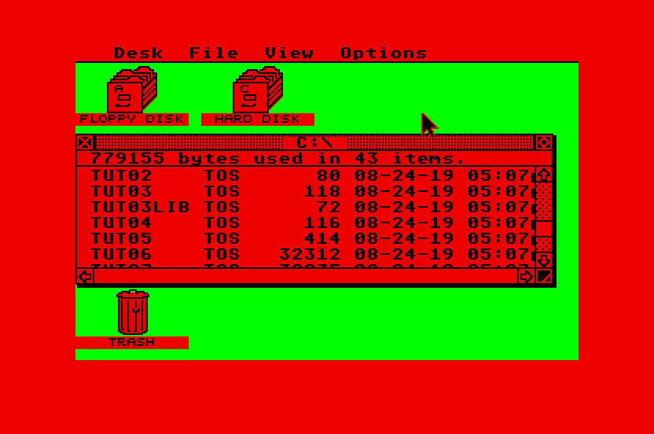

== Of The Workings Of Devpac 3 And The Realisation Of Some Code
_2002-06-14 (last edition of the initial revision)_

[quote, Tai Chi Master]
____
No immovable roots, no stirring of dust, only the tao; the way of
nature. This is called tai chi.
____

Hello again. It's only been some days since the last tutorial, but I'm bored right now and I
don't have any computer game I feel like playing. This weekend went great, as it was
GothCon (game convention here in Göteborg, Sweden) which meant games were afoot. I met
Aldebaran for the first time IRL and he demonstrated the game Illuminati, which I plan to
play later on this evening. But you don't really want to listen to that, do you?

In the last tutorial, we went through some basic theory behind programming, and now we
are going to put that theory into practice. We want to do something so awfully cool as to
change the background colour to something else. First, we need to gather and learn how to
use the tools. The tools in this case are only one; Devpac 3.00 by HiSoft. It can be acquired
from Pompey Pirates CD #114, other places, or perhaps you can even buy it :)

Once we start up Devpac, we want to change some settings to make our lives easier. Go into
options - control, under the setting format, select ST RAM, depending on your memory size,
you may also wish to change the memory buffer. The only two interesting settings here are
ST RAM and Atari Executable. If you choose Atari Executable, you will get a `.prg` file every
time you assemble (also known as compile) your source code, so in order to test your source
code, you will have to quit Devpac, and run the `.prg` file, then start Devpac again;
enormously clumsy. Instead, we put the `.prg` file directly into the ST RAM (memory, RAM
stands for Random Access Memory), from where it can be executed directly. So for now, set
the setting to ST RAM. It's only when you are done coding something, that you will want to
change this setting to Atari Executable in order to get a normal `.prg` file. Go into options -
options, and uncheck the "Check absolutes for missing #". This eliminates lots of error
reports than usually aren't error reports. In the options - environment you can set the
environment variables, if you run from diskette, they should probably be something like
`PATH=a:\bin,INCDIR=a:\incdir`. Go into options - resident and make sure both Assembler
and Debugger are checked, this will also save you lots of time if you have the memory (since
I run on 4 megs, I don't have to worry). That's about it I think, you can play around with
settings on your own if you like, but these are essentials in my opinion.

OK, we have our environment (Devpac) correctly configured, now we want to do something.
Remembering the past lesson, we soon realize that to change the background colour, we will
have to know what controls the background colour. On the
link:appendixes/hardware-register-listing.txt[Hardware Register Listing], by Dan Hollis,
you'll find a listing of the ST's memory, great for reference, in it we find the following lines:

[cols="4*^"]
|=====================
|$FF8240|word |Video palette register 0 |R/W
|...    |...  |...                      |...
|$FF825E|word |Video palette register 15|R/W
|=====================

As you may know, the ST is capable of displaying 16 colours at once, with a palette of 512
colours. Having a palette means that you don't have to stay with 16 fixed colours, by
changing the palette you can, say have 16 hues of red, and then 16 hues of blue on the next
screen. Imagine an artist that can only have 16 colours on each of his paintings, however, he
doesn't have to stick with the same 16 colours each time. OK, it seems that the first colour
starts at `$FF8240`, this is indeed colour 0 and it's the background colour, so by merely
changing the value here, we should change the background colour.

I talked about palettes just now, the ST is built on what you call RGB, Red Green Blue,
colour. Every colour is made up of 8 levels of Red, Green and Blue, because the computer
always counts from 0, the range is between 0 - 7. 8 × 8 × 8 = 512. So, the colour `$700`
would mean as red as you can get (maximum value of Red, zero value of Green and Blue).
`$770` would be yellow, `$777` would be white and `$000` would be black. Equipped with this
knowledge we enter this single line as our source code

[source]
----
                move.w  #$700, $ffff8240        ; red background color
----

Move is the command used for moving values around other values, in this case, we move the
value `#$700` into memory position `$ffff8240`. The `+#+` indicates that what comes after is an
absolute value, and the `$` means that the value is hexadecimal, instead of decimal (more on
this later, accept for now). The `.w` after the move instruction means that the move instruction
should move a word, indicating the size of the thing you want moved (more on this later also,
accept for now). So, the line above means in clear (?) English; move a value of word size, an
absolute value expressed as a hexadecimal value 700 into the memory address `$ffff8240`.
This should be enough to change the background colour to red.

Now we want to assemble the source code, and get our executable. Short command for this
in Devpac is `ALT+a`. Now, a window will pop up, displaying some statistics, what we want to
search for is especially the line "0 errors found". If there are errors found, the pointer will
automatically move to the error so that you can correct it. By pressing `ALT+<number>`, you can
cycle through the available windows. So, if you do get an error, but you don't understand it,
press for example `ALT+2`, which will take you to the second window, where the error report
probably is, try to understand something, then hit `ALT+1` to go back and edit your source
code. `CTRL+w` will close a window. Okie dokie, the source code has compiled successfully,
now we need to run it; hit `ALT+x` (e**X**ecute). Now you will be asked to pass parameters to
the program, don't, just hit enter. Oh, the expectation, will the background change to red?

NO! We get two fucking bombs for all our effort. What the fuck? Is there anything wrong
with the source code, no, it seems not. Is there anything wrong with the address? Double-
checking the address value, no, `$ffff8240` means colour 0, which is the background colour.
Well, the ST can operate in two modes, user and super mode. In the user mode, we aren't
allowed to access certain things in memory, for example the palette, the result if we try to do
this is two bombs. So we need to go into super mode. Referring to a list of the so called trap
functions of GEMDOS, ideally the ST Internals, we find out how to enter super mode, the
code looks like this:

[source]
----
                clr.l   -(a7)                  ; clear stack
                move.w  #32, -(a7)             ; prepare for super mode
                trap    #1                     ; call gemdos
                addq.l  #6, a7                 ; clear up stack
                move.l  d0, old_stack          ; backup old stack pointer
----

(ok, so the code looks somewhat different than in ST Internals, a good lesson for you that
you can write differently, but still achieve the same)

Perhaps I shouldn't go too deeply into this, it will come in the next tutorial where I'll take up
the different registers and talk about traps and so on. For now, you'll just have to accept it,
but for you curious types, here's a short one. The GEMDOS has several special functions,
which are accessed by the `trap #1` command (calling `trap #13` calls BIOS functions). The
controlling value is put on the stack, which is address register `a7` (you can also type `sp`, short
for stack pointer, instead of `a7`). The `move.l d0, old_stack` is for backing up the old user
stack, which gets replaced when we go into super mode.

This code obviously goes at the top of our source code, the first thing we want is to go into
super mode, then we put red colour in palette register 0, lastly, we want to go back into user
mode and also add another two lines of "accept now, understand later" code, which will make
a clean exit of the program. The total code looks like this:

[source]
----
include::src/tut02.s[]
----

Running this program will successfully change the background colour to red, and then make a
nice and clean exit, restoring the Atari to user mode once again.

.Red background

Problem is, we now have a red background. Not to good you might think. This can be easily
remedied however, we have made a program that changes background colour, let's use it!
Change the value `#$700` to `#$777` and run the program again. The background colour
will now be white as snow, like we're used to.

In the next tutorial, I plan to cover hexadecimal, binary and decimal numbers, program flow
and talk some about traps and registers.

