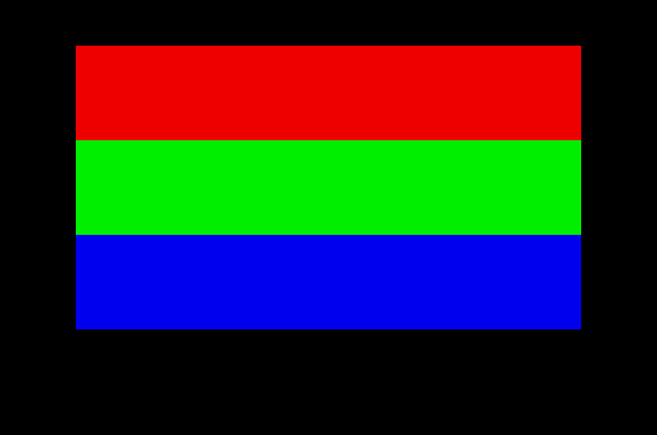

= Of The Workings Of The Graphics Memory And Minor Skills In Branching
:source-language: m68k
perihelion of poSTmortem
2002-07-01 (last edition of the initial revision)

[quote, Romeo and Juliet]
____
She doth teach the torches to burn bright
____

It's 10:13 in the morning, school will start at 1 o'clock so I have some spare time before I'm
at it. I've hooked Direct Connect up on some downloads; one Bruce Lee movie and one Yun
Fat Chow movie, I've loaded over 70 minutes worth of Atari chip music in Winamp, time to do
some serious writing.

As promised in the title, this tutorial will be all about the graphics memory, which really is all
you need to manipulate graphics on the Atari. So, if you really try hard, you should be able to
do scrollers after reading this tutorial, but don't overextend; I plan to cover scrollers in the
next tutorial anyways, because they are so good to practice your skills. First though, I
thought I'd take a quick repetition and just go over a few basic things.

[options="header",cols="2*^"]
|=========================
| Symbol | Meaning
| `+#+`    | decimal value
| `+#%+`   | binary value
| `+#$+`   | hexadecimal value
| `$`    | memory address, expressed in hexadecimal
| `.b`   | Byte
| `.w`   | Word
| `.l`   | Longword
|=========================

One bit is either a 1 or a 0. There are 8 bits to a byte, two bytes to a word and 2 words to a
longword, meaning there are four bytes to a longword. BTW, four bits are called a nibble,
which is half a byte. The smallest addressable memory block is a byte, meaning that every
count of an address is a byte. This means that if `a0` points to `$100`, and you do a `move.w
#10, -(a0)`, a0 will point to $98. `A0` will decrement by two, because a word is two bytes. If `a0`
points at `$100`, and you do a `move.l #10, (a0)+`, the value in a0 will be `$104`, since a
longword is four bytes. The value at memory address `$100` will be 10, also, in the previous
example with post decrementation, the value at `$98` will be 10, we don't know the value of
`$100`.

I find it easiest to organize my files on the PC, and then transfer what I need to the Atari.
You can booo all you want, I don't care! It's really easy to transfer stuff to the Atari, all you
need is a diskette formatted in the correct way, you can even use a PC diskette. If you look
at an old Atari disk, and a new PC disk, you will see one big difference; there is a hole on the
left side of the PC disk, on the same spot that the write protection hole is at on the right side,
on the Atari disk, there is no hole. Default size for Atari disks is 720 k, whereas on the PC, it's
1.44 megs (twice 720 k).

Sometimes, you can use PC disks for the Atari without any modifications, just format it to 720 k,
the default if you format it in GEM on the Atari. If this doesn't work, just put some tape
over the hole, this way, the PC disk will look like an Atari disk. Great huh? Now you can
organize your files on the PC, and have loads of stuff, then, when you need it on the Atari,
just put the files you want over on a disk and use it. This disk will work fine on both systems.
Only restriction is that you must have it in 720 k format. This can also be done on the PC by
formatting in this way `format a: /f:720`. If you didn't know this, you'll probably kick my ass
for not telling you earlier, hehe, suffer.

Now, on to coding again. As you may have guessed, what you see on the monitor (or TV) is
controlled by memory in the Atari. Before explaining that, however, I shall go into the
different resolutions. There are low, medium and high, easy as pie. High resolution is that
which we find only on monochrome monitors, it's 640×400 pixels, and uses only two colours.
Medium resolution is 640×200 pixels and uses four colours. Finally, the most interesting
resolution is low, featuring 320×200 pixels with 16 colours. A pixel, btw, is a dot on the
screen, if you look closer in a game or so, you'll se that the spaceship/dude/whatever is build
up of small dots, those are pixels. The upper left corner is considered 0,0 in a coordination
system, and the bottom right corner is the maximum. Thus, in low resolution, the pixel at 0 x
and 0 y is in the left uppermost corner, and the pixel at 319 x and 199 y is at the bottommost
right position.

How, then, is this represented in memory? For high resolution, it's very simple, each pixel is
represented by a bit, either 1 (black) or 0 (white). Thus, if you change the first bit in the
graphics memory (sometimes also called screen memory), you will change the bit in the left
uppermost corner, the pixel at 0,0. If you change the last bit in the screen memory, you'll
change the pixel at 639,399. Since one pixel is represented by one bit, it's easy to calculate
how much memory is used, 8 pixels are one byte. 16 pixels one word and a longword will
hold data for 32 pixels. 640×400 = 256000, the number of pixels total. If we divide this by 8,
we will get how many bytes the screen memory will have to be, this is 32000 bytes.

In medium resolution, we have four colours. Hmm, four colours, how do we represent a value
between 0 and 3? Well, we can use two bits, since `%11` (binary 11) is 3. So now, we need
two bits to represent each pixel. Also, the number of possible lines has dropped by half to
200 instead of 400, meaning that medium and high resolution both use 32000 bytes of
memory. You might think that the two bits for each pixel are right next to each other, not so,
they are spread over what you call bit planes, but that will come in just a little sec, since it's
extremely complicated.

Low resolution has 16 colours. `%1111` is 15, so we need 4 bits to represent each pixel in low
resolution. The number of pixels per line is reduced by half, and the number of bits per pixel
is doubled, meaning that we still have 32000 bytes of screen memory. If you don't believe
me, we'll do the math again. 320×200 is 64000 pixels, each pixel needs 4 bits to represent it,
meaning 256000 bits, at eight bits to a byte, we again get 32000 bytes.

On to the bitplanes, I will go through how it works in low resolution, since that is the most
interesting mode and the exact same technique is used in medium resolution, but with only
two bit planes instead of four. OK, here goes. The pixels are stored in words, in groups of 16
(remember, 16 bits in a word). The first 16 pixels are thus stored in 4 words, that come after
one another. Thus, the first 4 words of the screen memory are used to store the first 16
pixels. I'm feeling I'm loosing it here, this is damn hard to explain, and it took me weeks
before I got it myself.

The bit in the first word is the least significant bit in the colour number. Least significant
means the rightmost bit, since this is the one that affect the value the least (it either adds
one or zero to the final value), while the most significant bit is the leftmost bit. The bit in the
fourth word is the most significant bit in the colour number. The first bits in the first four
words control the first pixel. Are you confused yet? An example perhaps.

[options="header",cols="2*^"]
|=========================
2+| Graphics memory, expressed in binary
| `%1000000000000000` | first word
| `%0000000000000000` | second word
| `%0000000000000000` | third word
| `%0000000000000000` | fourth word
|=========================

[options="header",cols="1*^"]
|=========================
| Colour number of pixels, expressed in hex for ease of reading
| $1000000000000000
|=========================

The only bit that is set, is the least significant bit of the first word in the series. The term
"set" means that a bit has the value 1, and not 0. This means that the first pixel will be colour
1.

[options="header",cols="2*^"]
|=========================
2+| Graphics memory, expressed in binary
| `%1100000000000000` | first word
| `%1100000000000101` | second word
| `%0100000000000110` | third word
| `%0110000000000000` | fourth word
|=========================

[options="header",cols="1*^"]
|=========================
| Colour number of pixels, expressed in hex for ease of reading
| $3F80000000000642
|=========================

As you can see, just read top down, and you'll have it.

So, in order to address the 17th pixel, you'd first have to "jump over" the first four words of
graphics memory, then manipulate the first bit in the next four words. This makes pixel
manipulation a pain in the ass, since not only do you have to change values in four different
places, but you also have to work with bit manipulation. All in all, very tedious and time
consuming work. Just for comparison, there is a graphics mode on the PC, the MCGA mode,
which is extremely user friendly. It also has 320×200 pixels, but 256 colours instead. Does
this value ring a bell? It's a byte! So, each pixel is represented by a byte, making it a wonder
of ease of use. In order to change the pixel, you just have to address the correct byte, which
is dead simple. It would be done like this, `move.b #255, (a0)` where a0 points to address
memory. This would change the first pixel to colour 255. Or to change the third pixel, `move.b
#255, 3(a0). But to change the first pixel on the Atari, in low resolution, we instead have to
do something like this.

[source]
----
                ; a0 points to screen memory
                move.w  #%1000000000000000, (a0)
                move.w  #%0000000000000000, 2(a0)
                move.w  #%0000000000000000, 4(a0)
                move.w  #%0000000000000000, 6(a0)
----

This sets the first pixel to colour 1. The numbers before `(a0)` are, as you might recall,
indexes to memory, so `2(a0)` means where `a0` points plus two. Since we constantly want to
point to the next word, we must increase the pointer by two bytes each time. We could also
have used a `(a0)+` in order to increment the pointer, but then a0 would not have pointed to
the beginning of the screen memory anymore. It all depends on what you want to be doing.
Also note, that since we move information in, any information previously there, will be lost.
If, for example, pixel three and four already had values of some kind, and we executed the
commands above, they would become colour zero, since information regarding them would
be overwritten with all zeros as shown above.

Now you hopefully possess the knowledge necessary for understanding my short little
program. Let me just stress that really getting the workings of the graphics memory is very
difficult. What bit goes where, what bit does what, and so forth, so don't despair when you
don't get it right away; you have a long way ahead of you. Oh, I realized, I have some more
things to tell you.

A scan line is a row of pixels, there are 200 scan lines in low resolution. That's easy enough.
The other thing I have to tell you is about the VBL, or **V**ertical **BL**ank. The Atari operates in
either PAL (Phase Alternating Line) or NTSC (National Television Standards Committee):
NTSC is the American standard and PAL the European. Since I'm from Europe and it also
seems that most Atari related stuff is from Europe, NTSC will be given little support, take that
Yankees. The PAL or NTSC has to do with how many times per second the screen is updated,
in NTSC, it's 60 times per second, and in PAL it's 50. Thus, the so called refresh rate, is either
50 or 60 Hz. On game menus, you can often change between these modes. When I was
little, and only played games, I never got what the 50/60 selection on the game menu was
about, now I do. Since we use PAL, the refresh rate on our stuff will be 50 Hz, meaning that
the monitor is updated 50 times per second.

The screen is painted by an electron beam, that starts in the upper left corner, and then
works its way down, doing a scan line, and then moving on to the next. This happens 50 (or
60) times every second. It's good practice to synch your graphics with this beam, this will be
further expanded in the next tutorial. There is a trap, that will put the system in pause until
the next VBL, that is, the next time the electron beam is about to paint the screen. This is an
excellent timer, and will allow you to know exactly how much time everything takes. Just
think about it, if you put the wait for VBL trap in the beginning of your main loop, you'll know
that the loop will perform 50 times per second. This is ideal for making games or demos not
run to fast. The trap function number is 37, it's called by XBIOS and looks like this:

[source]
----
                move.w  #37, -(a7)               ; wait vbl
                trap    #14                      ; call XBIOS
                addq.l  #2, a7                   ; clean up stack
----

This is a good thing to include in your graphics library if you have one, if you don't, you might
think about making one.

I realize when looking over the source code again, that there are some more things to
explain. Hehe, well, at least I explain them sometime, and I don't just dump the source code
on you and let you browse through those instruction sets and figure things out for yourself.
Of course, it's a good thing to know where the graphics memory is, unlike some other
computers that has a fixed location for the screen memory, the Atari can use any part of the
memory. This simple trap will put the address of the graphics memory in d0, which you then
can move into the address register of your choice.

[source]
----
                move.w  #2, -(a7)                ; get physbase
                trap    #14                      ; call XBIOS
                addq.l  #2, a7                   ; clean up stack
                move.l  d0, a0                   ; a0 points to screen
----

Actually, it might be somewhat of a bad habit to use registers `d0`-`d2` and `a0`-`a2` unless you
have to, since those registers can be destroyed by, for example, calling traps, and other
similar things handled by parts you don't have full control over. Physbase here stands for
physical base, and means the physical base of the graphics memory. Note also, that when
moving addresses, like the last command above, you should always use longword size. This is
so because the Atari uses 24-bit addresses, each address is 24-bits long, and if you only
move a word, or heavens, a byte, information will be lost.

What more, oh yes, the `dbf` and `clr` commands. We'll start with the easy one, `clr`. **CL**ea**R**
clears all bits in the effective address operand. In clear English, this means "make something
zero". For example:

[source]
----
                move.l  #$100, a0
                move.l  #10, d0
                move.l  d0, (a0)
                clr.l   d0
                clr.l   (a0)
----

Now both `d0` and `$100` will contain zero.

The `dbf` command is a bit special. Instead of `dbf`, you can also use `dbra`. It is used for making
a loop a certain amount of times, it's the equivalent to a for-loop in high level languages.
When using the command, you give a controlling data register, and the address to loop. Each
time, the data register will get decremented by one, and then it will be tested to see if it's -1,
if it's not, the execution will jump to the given address.

[source]
----
                move.l  #$100, a0
                move.w  #4, d0                   ; execute loop 5 times
loop
                move.l  d0, (a0)+
                dbf     d0, loop
----

So, can you figure out what the memory configuration will be for this?

[options="header,footer",cols="2*^"]
|=========================
| Memory | Value
| $100   | 4
| $104   | 3
| $108   | 2
| $10C   | 1
| $110   | 0
2+| (some hex counting training as well, aren't I nice?)
|=========================

Since the value gets decremented right before it's tested for -1, the loop is never looped
through with the value -1. So, if you want a loop to loop five times, put four in the controlling
data register. Remember that on the last loop, the data register will contain zero. That should
be it, finally, we can get to my training program. You should be able to figure it out yourself,
but I hate it when people say that and I still have many questions, so I'll walk you through it.

The program fills the first 60 scan lines with colour 1, the next 60 with colour 2 and the next
60 with colour 3. Then it sets the colour values for these three colours to the maximum level
of the three "main colours", RGB, or red, green and blue. When this set up is done, it
decrements the value for each colour by one every half second, when the values reach zero
(black) the program terminates itself. The countdown itself is achieved by first waiting 25
VBLs, and then running through 7 such waits.

[source]
----
include::src/tut05.s[]
----

.3 colors

Oh, naughty me, I added a bunch of stuff to my initlib without telling you about it. Well, right
now, you'll just have to accept it, any problems with that private!? The thing it does is to save
all information regarding resolution, screen setup and so on, then change to low resolution.
When the restore subroutine is called, it restores everything as it was. While time goes by, I
probably won't dump all my source code into my tutorials, for example, an `include initlib.s` will
probably be the way in the future. I'm also thinking about sticking to just give out the
separate `.s` file with the source code, and only comment it here in the main tutorial so you
won't have the same code in two places. How does that sound? You curious types can go
through the initlib code, and try to figure it out, I have commented it quite well just so you
can do that.

There might be some problems with the math here, in the clear routine, 8000 is given as the
screen size. Yes, 8000 longwords, 8000×4 = 32000 bytes. 1199, or rather 1200 should equal
60 scan lines? Yes, every pass through the fill-loop moves 4 words. 4 words contain
information for 16 pixels, meaning that for every loop, 16 pixels will be set. 320×60=19200
pixels total (320 pixels per scan line), and since we set 16 pixels per loop, we divide this
value by 16 to get the total number of loops, which, incidentally, is 1200. That should clear
any trouble with the numbers.

I hope there's no trouble with the main loop part, the first little loop is all about making 25
VBLs, in other words, waiting for 0.5 seconds. Then, the colour values are changed, making
the colours 1,2 and 3 go towards black. Lastly, another loop controller that makes sure the
main loop is looped through seven times.

Now that you are equipped with basic knowledge of the graphics memory, I think we'll be
able to handle a scroller in the next part. It depends, I'll have to write one and see if it's not
too complex. If it is too complex, you'll probably be looking at a theory tutorial again.

