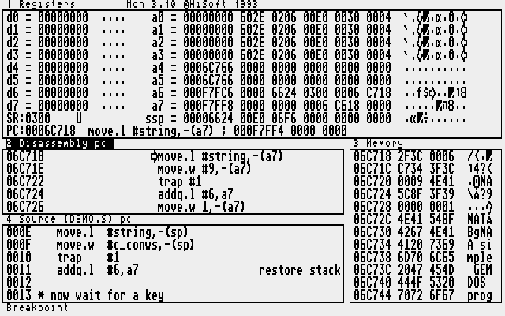

== Of Seeing Behind The Curtain Of An Execution And Getting Intimate With Files
_2002-07-01 (last edition of the initial revision)_

[quote, Fong Sai-Yuk]
____
Great! I love fighting.
____

Hiya'all, it's been a little while since the last tutorial. Mainly because I wanted to code a little
bit for myself and not only write stuff. This tutorial will NOT be about scrolling, unfortunately,
but it will cover the theoretical base which you'll need to be able to do the scrolling as will be
covered in the next tutorial. However, after this tutorial, you may figure it out by yourself. Of
course, the thing you have to do to scroll, is to just move the correct screen memory bytes to
the correct place. This will be covered in depth in the next tutorial, promise.

We're now beginning to get past the most fundamental theory, and so our code is getting to
be more and more advanced. This in turn means that often, a program will assemble without
errors, but it still won't work the way we want it to. Something somewhere is not as we
thought it would be, a variable might not be assigned the correct value, a mathematical
equation might not produce what we thought and so on; endless possibilities. This is where
the debugger comes in. Debugger? says you. To illustrate, let me tell you this fairy tale.

In the olden days, there was a big computer. So big it was that two men could not put their
arms around it. The computer stood in the big country that lies west of here, and all day long
it crunched numbers. It was very happy. Then, one day, it could not crunch numbers any
more, something was wrong and the computer fell sick. All the people in white robes, that
saw to the computers every need, were greatly distressed. No one knew what was wrong.
So, in a last desperate effort, they opened up the poor computer to have a look inside. They
found that a little bug had flown in, and that was the root to the sickness. So, the people in
the white robes removed the bug, and the computer was again healthy. It was all smiles and
could once again crunch numbers all day long. Thus endeth the tale. (since this is a fairy tale,
I make no claims that the exact facts are true, but like all legends, it contain a grain of truth)

Debugging, is the art of removing errors from source code. This is actually very hard, and
one can probably be as skilled in debugging as writing code in the first place. Debugging
usually takes at least half the time of developing a program, so good planning and lots of
time in the debugger is a good thing indeed. Nowadays, bugs are errors in the source code,
rather than actually physical bugs. Debugging is getting rid of bugs, creating error free code,
and a debugger is a tool that helps you with this process. Devpac comes with a debugger,
called MonST, I guess it stands for MONitor ST.

After you've assembled to memory, instead of pressing `ALT+x` and run the program, you can
press `ALT+m` and run the MonST, henceforth referred to as the debugger. Lots of information
will pop at you, and after you've come over the shock, you'll start to make quick sense of it.
There are three "windows", areas rather, registers, disassembly pc and the memory. The
disassembly pc area is your actual source code, the other two should speak for themselves.
When you are in debugger mode, instructions will be executed one at a time, this allows you
to see how each instructions change the content of memory and registers. I'll go through
each area and what you do with it.

.MonST

Registers, here you have the content of all data registers, all address registers, the status
register and the program counter. All values are given in hex, which makes every two digits
one byte, and each digit one nibble. As you can see, there are eight digits for each data
register, which makes sense since you can store a longword in a data register. When data
registers are beginning to get filled with values, there will pop up some symbols, sometimes
strange, to the right of the register. These symbols are the ASCII equivalents for each byte in
the data register. We haven't talked about ASCII I think, but it's the way to represent
characters with numbers I mentioned back in tutorial one. For example, the number `$41` is
the letter `A`.

The address registers are to the right of the data registers, and work pretty much the same.
To the right of the address registers, are the memory content that the address register points
to. Since there are four digits to every group, each group is a word. Thus, to the right of each
address register, is the memory content of the first five words that the address register points
to. To the right of the memory content, you'll also see ASCII representations of the content,
just as with the data registers.

Below the data registers, are the status register and the program counter. The status register
haven't been mentioned much either, but it takes note of several statuses of the ST, for now,
it will probably be 0300 and you'll se a `U` to the right of it. The U means User mode, and
that's what we're in now until we change it to Supervisor. The status register will also keep
track if a mathematical operation results in a overflow and so on. An overflow is when the
number generated is bigger than can be stored, for example, adding two data registers with
very big values will generate a value to big to store in one data register, so data loss will
occur. Below the status register is the program counter, and to the right of the program
counter you'll see the instruction that it points to.

The disassembly area is the code you're currently debugging. It will look just like your source
code. You can scroll up and down the code, and a little arrow will indicate your current
position. To execute a line of code, press `ALT+z`, to skip a line of code, press `ALT+s`. Usually,
you'll want to skip jumping into the initialise subroutine, because this takes some time and
might also put the ST in low resolution, making it hard to see anything. You'll usually want to
go to the mathematical equations directly, to see what happens. There's also a very nice way
to jump straight to a position of your choosing. You can put "flags" in your source code, by
entering the command "illegal", then, when in debugger mode, hit `CTRL+r`. This will execute all
commands from your current position to the next illegal position, you'll have to skip past the
illegal instruction to continue, using `ALT+s`. A great way for executing an entire loop without
stepping through it all.

The memory area is most interesting, this is where the entire content of the memory is listed.
By pressing `m`, you can type in the name of any memory tag (variable) that you are using,
and see what the memory that it points to contains. If you're smart, you'll immediately type
in `ff8240`, which will take you directly to the palette. Unfortunately, that will get you little,
since this is protected memory, you'll only see `+*+`'s.

You can change between these areas by pressing tab, and you can only issue commands in
the active area. When you are done debugging, you don't have to wait for the whole program
to execute and terminate, just hit `CTRL+c`, twice. Now this is useful, right? The best way to get
to the workings of the debugger is, like always in programming, to get to it; debug some
simple piece of code and see what happens to the registers and memory. Oh, yes, in the
memory area, you can also type in `aN` (where n is 0-7) to get directly to the memory area
pointed to by an address register.

Now, onto file formats! A file is simply a collection of data. There really is no such thing as a
`.pi1` (Degas Elite) file, or an `.mp3` file. A file contains data, so, this data is interpreted.
Different things will happen depending on how you interpret the data. Let's say, for example,
that we have a file containing only a byte, and it holds this data

----
%01000001
----

Easy, says some paint program, these are the first eight pixels in monochrome mode. Pixel
number 2 and 8 is supposed to be black, the rest are white. No, says the text editor,
`%01000001` is `$41`, which corresponds to ASCII character `A`. This is the letter A. Nonsense,
says the home taxation program, `%01000001` is a control code in my program that says this
file represents a terminated account... and so on. Programs interpret files, and do something
with the information. Since programs are also files themselves, interpreted by the operation
system, which is itself also files more or less, the whole shit is built on subjective opinions on
what to do with the data presented.

Given the information above, one might think that it's a good way to know how different
programs interpret data, this is the knowledge of file formats. In order to understand this, we
will examine a very simple file format, the Degas Elite `.pi1` file format. It's almost too simple
really, but it's useful and we're going to use it in our next tutorial. Usually, files have so called
file headers, which give some information about the file. For example, a Windows BMP file,
starts with the ASCII codes for `B` and `M`, which makes sense and gives a signal of what kind
of file it is. It's of a little nerdy interest to know that each `.exe` file on the PC, starts with the
ASCII codes for the letters `MZ`, which was some hot shot in Microsoft back when they
defined the file format (and perhaps still). A good example of a file header could perhaps be
the resolution of an image, or the font type in a word processor file.

In order to examine files correctly, we need a so called hex editor. A normal text editor will
not do, since the text editor would interpret data as ASCII code, we want a program that just
presents the data in the file, and does not interpret it in any way. With this hex editor, you
can "hack" files yourself. Say, for example, that you want a program that converts one
graphic file format to another; you'd need knowledge of both file formats. Sit down with a
paint program, and a hex editor. Do some small changes in the paint program, and watch
what's changing in the file with the hex editor. This is tedious work, at best, and you're
probably better off trying to locate the information somewhere. So, in order for you to begin
and try out your efforts, I will tell you how the `.pi1` files look like.

First, there are two bytes giving the resolution, in low resolution, it's just 0, in medium, 1,
and in high resolution, 2. Then comes 32 bytes containing the palette data for the picture.
After that comes the pixel information, looking exactly the way it does in the screen memory.
And that is that. Very simple file format indeed. So, how big is a `.pi1` file then, only knowing
the above? 32034 bytes. 32000 bytes for the pixel information, 32 bytes for the palette, and
two extra bytes in the beginning of the file. Here's a little program that will display a `.pi1` file
(a little note: in Degas Elite, there are 32 bytes in the end containing information on
animation and stuff, uninteresting in our case).

[source]
----
include::src/tut06.s[]
----

.Jet Li

There are three new instructions here, `movem`, `incbin` and `include`. Include is the easy one,
just consider it as though you had pasted the entire contents of the `initlib.s` file on the include
line. As you will see, when you assemble the code, this takes a while since the Atari needs to
read the file each time. Therefore, I strongly suggest you actually do paste the file in, instead
of just including it. Your choice.

Incbin, as you may have guessed, is the way to include files, they fall under the section data.
This puts the entire contents of the file in memory. In this particular case, I put the entire
contents of the `.pi1` file called `jet_li.pi1` at the memory position I choose to call `picture`. You
can achieve the same result by hand copying the content of `jet_li.pi1`. Something like
`picture dc.b 0,0,0,0,$07,$11...` (this is the beginning of the file)

Movem MOVEs Multiple data from memory to registers or the other way around. It can only
move words and longwords. As you can see, I move the memory from `picture+2` into the
data registers. This is great since all eight data registers can hold all in all 32 bytes of data,
since each colour is 2 bytes of data, this means that the entire palette of 16×2 bytes of data
fits precisely into the eight data registers. The reason for `picture+2` is that we want to skip
the first two bytes, since they only contain resolution information. After filling the data
registers with the palette, we just smack it in at the correct starting address.

Then, it's a question of putting the screen memory pointer in `a0`, and the start of the pixel
part of the picture in `a1`. The `picture+34` is because this is where the pixel part starts, 2
resolution bytes plus 32 palette bytes is 34 bytes that should be skipped in order to reach the
pixel part. As shown in the previous tutorial, the screen size is 8000 longwords. I just loop
through that amount, copying the content from the picture into the screen memory. Easy?
This is a small loader for `.pi1` files. If you assemble this piece of code as a `.prg` file (or just
take my pre-assembled file), you'll notice that the program size will be 32494. Most of this is
the `.pi1` file itself, our added code is only 32494 - 32034 = 460 bytes. We now have a self-
loading `.pi1` image, nice.

If you think it would be amusing, you can add this little loader to all your .pi1 files, in this
way, you'll never have to go through Degas to watch them, they load themselves. Of course,
you'll get a `.prg` file instead of a `.pi1` file, meaning that you can't edit it with Degas. But then
you could write your own program for extracting the image information and turn it into a `.pi1`
file again. Fun, right? Note; you don't have to keep the original `.pi1` file for this "loader" to
work, since the `.prg` file contains the data it needs for the image.

While we're on the topic, I will mention, briefly, compression. You must know what file
compression is, it's making a file smaller, but usually useless, until you decompress, or
unpack, it again. How does this work? The file can't just shrink, can it? Well, more or less, it
actually can. Consider this information:

----
%00000000
%11111111
----

The first byte is all 0's, and the second one all 1's. Suppose we replace the information given
with:

----
08
18
----

and tell the program that after each 1's or 0's, there will be a number that tells how many 1's
or 0's there will be. If we have a file with big areas of similar data, for example 50 bytes of
0's and then 70 bytes of 1's, this so called compression algorithm would compress this
information into four bytes. It would look like this:

----
050
170
----

or, just to give you some bit mathematics, we say that the high bit of each byte controls
whether it should be 1's or 0's, and the next seven bits tell how many of each kind should
follow, it would look like this.

----
%00110010 50 0's
%11000110 70 1's
----

That was that on compression. The above is a very simple compression algorithm and if you
use it, you may end up with files bigger than they were from the beginning. I know file
compression was a bit sketchy, but if you get the part of how files work, the compression
part shouldn't be that hard. Also, file compression might be covered more extensively later.
So far, I know very little myself since I haven't used it for anything. I have no idea how good
file compression algorithms look or anything, so don't ask. This is just the theoretical base.
Study carefully, since I'm going to use a `.pi1` file for the font in the upcoming scroller.

