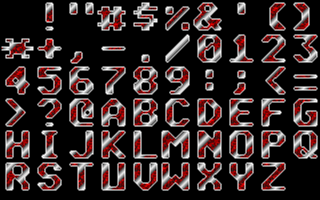
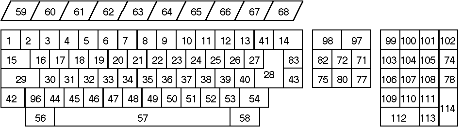
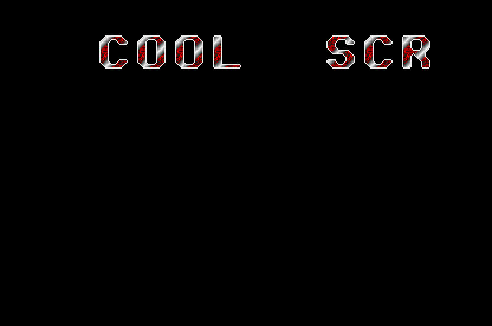

== On Scrollers
_2002-06-14 (last edition of the initial revision)_

[quote, The One]
____
My grandfather taught me the energy of life goes in a circle, in a
perfect flow; balanced. He said, until I find my centre, my circle
will never be whole
____

Huh, so finally, as promised; the tutorial on scrollers. BTW, all my "huh" sounds aren't like
American huh, as in a question or as in a "oh yeah?", but rather phew, like a sigh. Have you
been waiting for this one? I hope you have, because it was a damn pain in the ass to write
the scroller program, even though it's simple. It began with me reaching too high, also,
forgetting about the bitplane layout of the graphics memory. When I put a little lower
ambition level, for the sake of keeping it simple, things went smoother. Now, Luca Turilli
playing in Winamp, the mood is set, time to write. The people who already know how to do
scrollers will probably laugh their ass off at this clumsy scroller, which really is bad in every
way except learning the basic stuff, I'll probably do a more advanced one later on; I've heard
that building on knowledge is good.

A few happy news first. I've gotten mail from three different people, excluding Maarten
Martens. Thanks guys, you know who you are! One mail from FrEd highlighted a few misses I
made, concerning the compatibility with Devpac 2. My initlib had a little bug. It works fine in
Devpac 3, but not in 2. Two lines had `d0-7` in them, it really should read `d0-d7`, but it's fixed
now. I know some other things may also be difficult with other assemblers than Devpac 3, so
if the code doesn't work for you, just use Devpac 3. I have tested every piece of code with
that on an original Atari ST(e), so there should be no problem. Thanks go out to FrEd for
pointing this out, and also to mOdmate of Checkpoint for telling me a little about the
workings of `$fffc02`.

Yep, a scroller. I'm a bit unsure of where to start, but I guess I'll just work from the top
down. What does a scroller do? Letters go from the right of the screen, to the left of the
screen (usually). New letters are brought in from the right, "outside" of the screen. How can
this be achieved? The screen memory needs to be moved "to the left", and then we need
information to bring in the new characters from the right. OK, this seems to build on an idea
to have letters stored as graphics. Hum, yes, we have a font collection in a degas file. In that
way, we'll have letters in graphics format, we can take the information from the font file and
put it on the screen. Then, we move the screen memory to the left. Easy? No, damn hard for
a first timer at least.

Included in this tutorial should be a file called `font.pi1`, this is the font file, I stole it from
James Ingram's demo tutorials, so I wouldn't have to make my own. Immediately load this
up and look at it, either using Degas, the program from Chapter 6 or any other method.
Lucky lucky, lots of characters to choose from. Each character is 32 × 32 pixels big, resulting
in 10 characters per line. This is all well and fine, the next step is to actually know how to
point to the beginning of, for example, letter `C`. If we know where this letter begins, we can
put it on our screen simply by moving the data into the screen memory. Just as we did when
displaying a whole picture.

.font.pi1

The font picture is aligned with the ASCII table, meaning that it looks like the ASCII table
does. In the link:appendixes/ascii-table.txt[ASCII Table], by Stephen McNabb, you'll find an ASCII
table, in which you can look up the number for each character. As you can see, space (the
first character in the font), begins at `$20`, then comes `!` at `$21` and so on. This means, that if
we take the ASCII value for a character, and subtract by `$20`, we'll have the corresponding
number in the font. Hum, a test perhaps. `C` is at `$43` in ASCII, subtract `$20` makes `$23`,
which is 35 (decimal). There are 10 characters per line, so we skip to the fourth line, begin
counting; 0 (>), 1(?), 2(@), 3(A), 4(B), 5(C), yay, right on! (remember to start counting from
0).

Now we need to know what address this is at. The way to do this is to put the beginning of
the font picture address in an address register, and increment by a number. Think of the font
as a coordinate system, then `C` would be at 3,5. We need to increment the pointer by a
certain value for each coordinate, this shouldn't be to hard.

Each line is 160 bytes, and each character is 32 lines. This means that for every Y coordinate,
we need to increment the pointer by 32 × 160 bytes, right? Think about it, if we want `+*+`
which is on the second line (1,0), we need to point to the font address + 32 lines down. Each
character is 32 pixels wide, 16 pixels are 4 words, taking up 8 bytes, we need twice this. So
for each X coordinate, we need to increment the pointer by 16 bytes.

Does this seem right? Let's try. We want letter `C`, at 3,5. Thus we should increment by
3×32×160 + 5×16 = 15440 bytes. `C` is about the middle of the screen and 15440 is about
half of 32000, so it seems safe to assume that the formula above is working. Question is,
how do we get the X and Y coordinates? We had a value for C, right, that was 35. The first
digit seems to be the Y coordinate, and the second the X coordinate. If we divide 35 by 10
we get 3.5. 3 is the quotient and 5 the remainder. The instruction `divu` (**DIV**ide **U**nsigned)
puts the quotient in the lower word of a data register, and the remainder in the higher word.
`swap` is an instruction that swaps the low and high word in a data register. Great! We now
have what we need. The code looks like this:

[source]
----
                move.l  #character, a0           ; points to character
                move.l  #font+34, a1             ; points to pixel start

                move.b  (a0), d0                 ; put letter ascii value in d0

                add.b   #-$20, d0                ; align asciin with font number
                divu    #10, d0                  ; 10 letters per row

                move.w  d0, d1                   ; d1 contains y value
                swap    d0
                move.w  d0, d2                   ; d2 contains x value

                mulu    #16, d2                  ; 16 bytes for each letter
                mulu    #32, d1                  ; 32 lines per row
                mulu    #160, d1                 ; 160 bytes per row

                move.l  #font+34, a0             ; put font screen start in a0

                add.l   d2, d1                   ; add x and y value together
                add.l   d1, a0                   ; a0 points to correct letter

                section data
font            incbin  font.pi1
character       dc.b    "C"
----

Since each character is an ASCII value, we only use a byte to represent it. If we put things
inside "", that means we want the ASCII value. So the message `dc.b "C"`, means that
message is a byte containing the ASCII value for C. We could just as well have written
message `dc.b $43`, but this is more difficult to understand. Hopefully, the code will speak for
itself with the comments and the theory given above. This is not a complete program, but
just a code snippet to show the font part. More will follow.

We know how to point to the font, now we need to know how to shift the screen memory, in
order to achieve the scrolling effect. One would think that all it took was a big loop moving
bytes. Like so (`a0` and `a1` contain the address of the screen memory)

[source]
----
                add.l   #1, a1                   ; put a1 8 pixels ahead of a0
                move.l  #159, d0                 ; scroll a line
loop
                move.b  (a1)+, (a0)+
----

For each loop we take the byte one byte ahead, and move it one byte to the left. This should
move 8 pixels each loop, right? Wrong! Totally wrong! The screen is made of 16 pixel
clusters, each cluster being 8 bytes long. So when you just barge in and move single bytes
like that, you'll misalign the whole shit. Not only will the colours be misaligned, the pixels will
be as well. Consider this memory configuration.

[options="header,footer",cols="3*^"]
|=========================
| First byte | Second byte | 
| %11000000  | %00000000   | first word
| %11000000  | %00000101   | second word
| %01000000  | %00000110   | third word
| %01100000  | %00000000   | fourth word
| %00000000  | ...         | fifth word
3+|
| $3F800000  | $00000642   | pixels
|=========================

If we use the move loop from above, the first byte will drop out, the second byte will be
moved into the first byte, the first byte of the second word will go into the second byte of the
first word and so on, in the end, we get this.

[options="header,footer",cols="3*^"]
|=========================
| First byte | Second byte | 
| %00000000  | %11000000   | first word
| %00000101  | %01000000   | second word
| %00000110  | %01100000   | third word
| %00000000  | %00000000   | fourth word
3+| 
| $00000542  | $17400000   | pixels
|=========================

Not really, the pixels we had before. So, in order to overcome this in an easy way we move
16 pixels each time. This will produce a very fast scroller, but an easy one to code for. If we
move 16 pixels, we won't have to worry about getting misaligned bitplanes, since the 16 pixel
clusters will never be broken up, like they were above. `a0` and `a1` contains the screen
address, while `a2` points to the character in the font.

[source]
----
                add.l   #8, a1                   ; put a1 16 pixels ahead of a0
                move.l  #31, d1                  ; 32 lines to scroll
                move.l  #18, d0                  ; 19 16 pixel clusters + font part
scroll
                move.w  (a1)+, (a0)+
                move.w  (a1)+, (a0)+
                move.w  (a1)+, (a0)+
                move.w  (a1)+, (a0)+             ; 16 pixels moved
                dbf     d0, scroll               ; keep moving 16 pixel clusters
                move.l  #18, d0                  ; reset loop counter
                move.w  (a2), (a0)+
                move.w  2(a2), (a0)+
                move.w  4(a2), (a0)+             ; 16 pixels of the font
                move.w  6(a2), (a0)+             ; character moved in
                add.l   #8, a1                   ; increment screen pointer, align with
                                                 ; a0
                add.l   #160, a2                 ; next line of font
                dbf     d1, scroll               ; do another line
----

This is all just a bunch of move words, and some adds to keep everything aligned. The first
move section will move 4 words from `a1`, which points one 16 bit cluster ahead of `a0`, to `a0`.
This is repeated 19 times. After this loop, `a0` points to the beginning of the last 16 pixel
cluster, and `a0` points to the beginning of the second line. For the last 16 pixel cluster, we
want information from the font, not from the screen. So here we move information from `a2`
into `a0`. Instead of post incrementing `a2`, I use indexes. After the font data is moved onto the
screen, I add 8 to `a1`, so that it will again be 16 pixels ahead of `a0`. Since `a0` was incremented
during the font move part, and `a1` was not. 160 is added to `a2`, so that the font pointer will
now point to the next line in the font. Repeat for 32 lines.

Now the two most important techniques have been covered, how to know where the
character is in the font, and how to scroll. Now we mix and match. In order to synchronize
the entire scroller to the VBL, I put a wait VBL trap in the beginning of the main loop. Then I
do my stuff, and in the end of the main loop, I check if the space bar is pressed, if it is, just
drop out of the loop. If space bar is not pressed, then the main loop will begin again, with a
VBL wait, making sure that the main loop is looped through at 50 times a second. You'll
probably be wondering exactly how I determine whether the space bar is pressed.

This little piece will do the trick: `cmp.b #$39, $fffc02`. Uh, says you, looking at the ASCII table
(hopefully) and wondering how `$39` can be space, when it should be `$20`. The `$fffc02` part
can be easily guessed, this is probably where the last key press end up, but why `$39`? ASCII
deals with characters, and special characters like line feed and so. There's also something
called scan codes. Every key on the keyboard has its value, its scan code, so you'll be able to
determine what key was pressed. Look at the picture below:

.Keyboard Scan Codes

While we're still on the topic, I might as well give you the full detail. You can also check when
a key is released, not just pressed. When the key is released, the high bit of `$fffc02` is set,
meaning you get a whole different value. Consider this.

----
%00111001 $39 space pressed
%10111001 $b9 space released
----

So, if you `cmp.b #$b9`, then you check if space is released. This can be used in many fun
ways, like changing the background to red when space is pressed, then checking to see when
space is released and then restore background. Or accelerate a car in a car game until the
button is released, at which time you begin deceleration. I don't know how often this is
updated or how fast you can really press keys. Say for example that you check `$fffc02` every
VBL to see what key is pressed and released, suppose this dude is like Flash, and manage to
press a button, then release it and press another within 1/50 of a second, then you'd loose
the check for the release of the key, but I doubt you'll have to worry about this. Back to
reality, here's the scroller.

[source]
----
include::src/tut07.s[]
----

.A scroller

There are really only two more small things that are new; the font counter and the message
pointer. Also take note how I put in the scrolling message, by just using lots of `dc.b`, and a `0`
as an end control character. By changing the text here, you can obviously change the scroller
message. Perhaps to the well known "Hello World!", which I most deliberately avoided.

So what's the font counter and message address? Well, the font counter keeps track of when
it's time to calculate a new address for a new character. This is set to 2, because every
second loop, a whole character has been moved to the screen and the address for the next
character in the message will have to be calculated. Had we scrolled 8 pixels each VBL, the
font counter would have been set to 4 instead.

The message pointer is an index into the message. In order to know which character to get
next time, we must have some pointer into the message. The message pointer begins by
pointing to the message, which is good, since that's where the first character is. The first
time through the main loop, the font counter will announce that an address for a new
character will have to be calculated. That address is calculated and stored. The message
pointer will then point to the next character in the scroller message, which is space, and so
on. When the whole message has been scrolled through, the value 0 (not character `0`) will
be moved from the message. This is a signal that the message is at an end, and the message
pointer will be reset, once again pointing to the start of the message. I hope it's
understandable, the one tricky part is all the tests and branches, just walk through them a
couple of times, slowly. You can use pen and paper for this, or the MonST.

We've begun to get somewhere. If you've paid attention so far, you'll have acquired quite
some programming skills. There are still some basic things to cover, in order to be really self
sufficient (mainly timers, double buffering, sprites and bit manipulation) but you're on a good
way. Now might be the time to look at alternative sources and learn something from there.
For example, you could begin to look at James Ingram's demo coding tutorials. That was
where I began, I found them quite hard but now we've gotten more or less to the level
where he begins his stuff. That is that from me right now. Upon request from mOdmate of
Checkpoint, the next tutorial will probably be on timers, I think. This means we'll be able to
remove the bottom and top borders, cool stuff!

