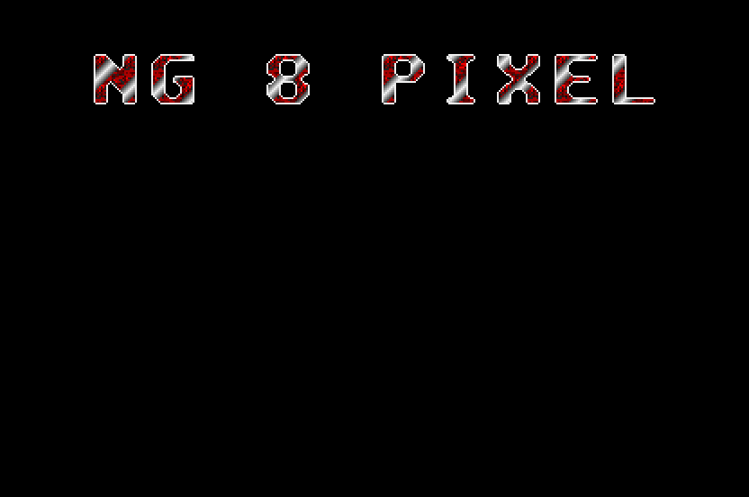

== Of Scrolling 8 Pixels Per VBL Using Double Buffer
_2002-06-14 (last edition of the initial revision)_

[quote, Bruce Lee]
____
Be formless, shapeless, like water. Now you put water into a cup;
it becomes the cup. You put water into a bottle; it becomes the
bottle. You put it into a tea pot; it becomes the tea pot. Now water
can flow, or it can crash. Be water my friend.
____

In the last few days, I've had the great opportunity to get lots of introduction to the Atari
scene. mOdmate of Checkpoint told me about #atariscne, and since then he's guided me
through the stuff, giving me links to good sites and generally telling me what I need to know
to orient myself. I've met some great people that have helped me understand things and
being a better coder. Also, let's not forget the importance of Maarten Martens for converting
this text file to html and banging me on the head whenever I take a wrong step. I could not
write this stuff alone, lots of thanks to all of you who make this text possible. I also want to
thank God, for giving me the luck and opportunity to be where I am, my mother for giving
birth to me and always being there and all ... (end of Hollywood speech)

In order to get an even better understanding of the bit planes, I've done an 8 pixel scroller.
The thing with this is that you must be careful not to misalign the bit planes, which we didn't
have to worry about when scrolling 16 pixels per VBL. Since not to much have changed since
the 16 pixel scroller, I thought I'd cover some other stuff as well.

First, I need to cover the shift command in order to be able to tell you about double buffering
(there are more than one shift command, but they'll be covered later). The shift command
will shift bits either left or right, as many "slots" as you want to. The command for shifting
left is `lsl`, meaning **L**ogical **S**hift **L**eft, and right is `lsr` for **L**ogical **S**hift
**R**ight. If you have a number in `d0` and right shift, like so:

[source]
----
                move.l  #%10110001, d0            ; d0 = 177
                lsr.l   #2, d0
----

then d0 will contain:

----
%00101100 44
----

all bits will jump two spaces to the right, and 0's have moved in from the left. Also note that
this was the same as dividing 177 by 4 and throwing away the remainder. Left shifting will
move bits to the left, and move 0's in from the right. Right shifting one is the same as
dividing by 2. Thus a `lsr.l #2` is the same as `divu.l #4`, and a `lsl.l #2` is the same as a `mulu.l
#4`. Only thing is that a shift is soooo much faster than a `mulu` or `divu`, but more on that
later. It's very important to note how big the shift area is, if you have a data register filled
with bits, but only shift a word, `lsr.b`, only the first 8 pixels will be affected. Like so:

[options="header",cols="3*^"]
|=========================
|      | Upper byte | Lower byte
| d0 = | %10101010  | %10101010
|=========================

[source]
----
               lsr.b   #4, d0
----

[options="header",cols="3*^"]
|=========================
|      | Upper byte | Lower byte
| d0 = | %1010101   | %000001010
|=========================

Note how the upper byte of the word was completely unchanged by the shift operation, since
we used a `lsr.b` operation.

Now we can go on with double buffering. This is an extremely important technique. The
screen is painted by an electron beam that goes from upper left, and then sweeps one
horizontal line, down to the bottom right, just as the screen coordinates. Now, what happens
if you start to make changes to the screen where the electron beam is painting? You will
experience flicker or a distorted line or any other horrible thing. In short, when you write to
screen memory, you'll most likely interrupt the electron beam in its work.

It is possible to change the area of memory that is the screen memory, any area of memory
can be the screen memory actually. So for every VBL (or even often), we can change what
area of memory is the screen memory. A solution begins to crystallize. We have two screen
area sized areas of memory, one which is the actual screen memory (being shown on the
monitor) and the other works as a buffer.

What we do is to update the buffer, while leaving the other screen alone, in this way, nothing
will happen to the screen memory while the electron beam is painting. Then, just in the
beginning of the next VBL, we make the buffer the screen memory and the screen memory
the buffer. In this way, we will never paint to the actual screen memory. One can also call the
memory that is being displayed for the physical base, and the area of memory not being
displayed for the logical base. So far, we've gotten the address to the physical base by calling
trap #2 of the XBIOS, if you call trap #3, you'll get the logical base. Usually, both of these
point to the same memory area.

Instead of getting the physical address from the Atari, we will now define our own area of
memory and input that address directly into memory. There's only one important thing to
know about the screen memory; it must be on a 256 byte boundary (unless you have a STe).
What this means is that the start address of the screen memory must be a multiple of 256.
This can be achieved by clearing the lower byte of the address, meaning that you'll need 256
bytes extra memory for your screen memory, so you can clear the lower byte. Why? Because
clearing away the byte will clear away anything not multipliable by 256, the size of a byte.

So, how do we make a memory area the screen memory? Smack up the link:appendixes/hardware-register-listing.txt[Hardware
Register Listing], and search for something appropriate, like "screen". We see this.

[cols="4*^"]
|=========================
| $FF8201 | byte | Video screen memory position (high Byte) | R/W
| $FF8203 | byte | Video screen memory position (mid Byte)  | R/W
| $FF820D | byte | Video screen memory position (low Byte)  | R/W (Ste)
|=========================

Sure, ok, seems to be what we need. The low byte in `$ff820d` is for STe's only, and should be
cleared at all times to avoid trouble. Then the middle byte of the screen address goes into
`$ff8203` and the high byte goes into `$ff8201`. In order to get the middle and high byte of the
screen address, we need to shift the address. By shifting down the eight bits constituting the
byte, we can easily move out bytes from the screen address by `move.b` commands.

[cols="5*^"]
|=========================
|        | High byte | Middle byte | Low byte  |
| screen | %00010111 | %01001101   | %10111110 | $174dbe
|=========================

first we clear the low byte in order to put it on a 256 boundary.

[source]
----
               move.l  #screen, d0
               clr.b   d0
----

[cols="4*^"]
|=========================
|        | High byte | Middle byte | Low byte
| screen | %00010111 | %01001101   | %00000000
|=========================

now we need to move the middle byte into `$ff8203`

[source]
----
               lsr.l   #8, d0
----

[cols="4*^"]
|=========================
|        | High byte | Middle byte | Low byte
| screen | %00000000 | %00010111   | %01001101
|=========================

[source]
----
               move.b  d0, $ff8203
----

As you see, the middle byte gets shifted into the lower byte. With a `move.b` command the
only thing we move is the lowest byte of `d0`. Thus, we have isolated the middle byte by
shifting it into a more convenient position. Now for the last one.

[source]
----
               lsr.w   #8, d0
----

[cols="4*^"]
|=========================
|        | High byte | Middle byte | Low byte
| screen | %00000000 | %00000000   | %00010111
|=========================

[source]
----
               move.b  d0, $ff8201
----

And that's it. We have now cleared the lowest byte of the screen address, and moved the
middle and high bytes of it into the correct memory position. screen is now the screen
memory. The compact code snippet looks like this.

[source]
----
                move.l  #screen1, d0             ; put screen1 address in d0
                clr.b   d0                       ; put on 256 byte boundary
                
                clr.b   $ffff820d                ; clear STe extra bit
                lsr.l   #8, d0
                move.b  d0, $ffff8203            ; put in mid screen address byte
                lsr.w   #8, d0
                move.b  d0, $ffff8201            ; put in high screen address byte
                
                section bss
                ds.b    256                      ; 256 byte clear buffer
screen          ds.b    32000                    ; the screen
----

Now, this doesn't make for any double buffer at all, since we're only using one screen. In
order to achieve double buffering, we need two screen areas, and two pointers to point to
each area. In each VBL, one screen is made into screen memory, and then the pointers are
flipped so that the other screen is made screen memory for next VBL. This really makes what
you see on the screen appear 1/50th of a second slower than what you draw.

[source]
----
                move.l  #screen1, d0             ; put screen1 address in d0

                ; prepare addresses
                ; make next and last point to screen1 and screen2
main
                ; wait VBL

                move.l  next, d0
                ; make address in d0 screen address

                move.l  last, a0
                move.l  next, a1                 ; load screens
                move.l  a1, last                 ; and flip them for next time around
                move.l  a0, next                 ; double buffering :)
; loads the screen addresses and flips them around

                ; do your stuff, like putting graphics to the address in a1

                ; repeat main loop

last            dc.l    0
next            dc.l    0

                ds.b    512
screen1         ds.b    32000
screen2         ds.b    32000
----

I also thought we might mention timing as well. This is quite the issue really, as you must
have understood, you can't perform an infinite number of instructions. Important information
is in two appendixes. link:appendixes/m68k-execution-times.txt[Motorola 68000 Instruction Execution Times]
explains how much time it takes to do each instruction. This can vary greatly, for example, a
division takes way over 100 clock cycles, and a shift takes under 10, so you see, it's a good
thing to replace your `divu` 's with `lsl` 's if possible. Also, when you can, work with byte or word
size, instead of long, since this saves some time also. Clock cycle is the quantity in which
"time" is measured. Each instruction takes a certain amount of clock cycles.

link:appendixes/pixel-timings.txt[Pixel Timings], was extracted by me from the ST
Internals text file by Jim Boulton. One interesting thing to note there is the amount of clock
cycles per VBL; 160256. This is a very exact number, and if your main loop ever takes more
time than that, you're screwed (if you work with VBL main loops as we've done so far that is).
One way to get a graphical pointer of how much time your main routine does take, is to
change the background colour just at the start of the routine, then change it back in the end.

Let's say we have a routine that takes 80000 clock cycles, our original background is black,
but in the beginning of our main loop, we set it to red. What will happen is that the electron
beam will paint red background, but when our 80000 clock cycles worth of instructions have
taken place, the background is switched back to black, which means that for the time it takes
to wait for the next VBL, the electron beam will paint black. So, in this case, the screen would
be half red background and half black background. If we use this technique, we'll see exactly
how much time our main routine takes. The example program in this tutorial takes up most
of the processor, which leaves little time for other stuff to be done. Granted, the scroller is
completely un-optimized.

Phew, now we have covered lots of small things of big importance. Finally, now comes the 8
pixel scroller part. Just look at the source code, it's well commented. Nah, I'm just kidding
with you, of course I'll explain. Since we now want to scroll 8 pixels, this means for starters
that we need to move bytes. The first byte represents the first 8 pixels, and the second the
coming 8 pixels. Then, the third word again has to do with the first 8 pixels, and the fourth
word has to do with the 8 coming pixels and so on. Thus, we cannot simply barge in and do
some scroll loop. We need to move every second byte.

[cols="5*^"]
|=========================
| Index | First byte | Index | Second byte |
| 0     | %11000000  | 1     | %00000000   | first word
| 2     | %11000000  | 3     | %00000101   | second word
| 4     | %01000000  | 5     | %00000110   | third word
| 6     | %01100000  | 7     | %00000000   | fourth word
| 0-7   | $3F800000  | 8-15  | $00000642   | pixels
|=========================

[cols="5*^"]
|=========================
| Index | First byte | Index | Second byte |
| 8     | %00000110  | 9     | %00100000   | first word
| 10    | %00000010  | 11    | %00100100   | second word
| 12    | %00000000  | 13    | %10000010   | third word
| 14    | %00100010  | 15    | %00010000   | fourth word
| 16-23 | $008001B0  | 24-31 | $40380240   | pixels
|=========================

It is tempting to read the memory top down, but this is not so, it is to be read from left to
right. So index 5 for example is the second byte in the third word, and affects pixels 8 - 15.
The memory without comments look like this, split into bytes for ease of reading.

----
%11000000, %00000000, %11000000, %00000101, %01000000, %00000110, %01100000,
%00000000, %00000110, %00100000, %00000010, %00100100, %00000000, %10000010,
%00100010, %00010000, ...
----

So in order to scroll 8 pixels, index 0, 2, 4 and 6 will de dropped, because they represent the
first 8 pixels. Then index 1, 3, 5 and 7 will be moved into index 0, 2, 4 and 6. Then index 8,
10, 12 and 14 will be moved into index 1, 3, 5 and 7. Then index 9, 11, 13 and 15 will be
moved into index 8, 10, 12 and 14. This will make pixels 0-7 to drop, 8-15 to be moved into
0-7, 16-23 will be moved into 8-15 and 24-31 will move into 16-23. After these move
instructions, the memory will look like this

[cols="5*^"]
|=========================
| Index | First byte | Index | Second byte |
| 0     | %00000000  | 1     | %00000110   | first word
| 2     | %00000101  | 3     | %00000010   | second word
| 4     | %00000110  | 5     | %00000000   | third word
| 6     | %00000000  | 7     | %00100010   | fourth word
| 0-7   | $00000642  | 8-15  | $008001B0   | pixels
|=========================

[cols="5*^"]
|=========================
| Index | First byte | Index | Second byte |
| 8     | %00100000  | 9     | ...         | first word
| 10    | %00100100  | 11    | ...         | second word
| 12    | %10000010  | 13    | ...         | third word
| 14    | %00010000  | 15    | ...         | fourth word
| 16-23 | $40380240  | 24-31 | ...         | pixels
|=========================

It is of the utmost importance that you realize why this is so. If you do not, set yourself down
and work it out until you get it and understand it 100%. Without understanding this, you'll
not understand bit planes, without understanding bit planes, you can't understand how the
graphics on the Atari works. Expressed in code, this will be (`a0` points to screen memory)

[source]
----
                move.b  1(a0), (a0)
                move.b  3(a0), 2(a0)
                move.b  5(a0), 4(a0)
                move.b  7(a0), 6(a0)             ; 8 pixels moved
                move.b  8(a0), 1(a0)             ; watch carefully!
                move.b  10(a0), 3(a0)
                move.b  12(a0), 5(a0)
                move.b  14(a0), 7(a0)            ; first 4 word area filled
                move.b  9(a0), 8(a0)             ; start of second 4 word area
                move.b  11(a0), 10(a0)
----

and so on. So first, four bytes are moved just one step to the left, but then you need to go
into the next 4 word area, to fetch the bytes that go into the second area of the first 4 word
area and so on. This is the theory behind 8 pixel scrolling, I don't think I can explain it better
than that. This is the source code for the scroller.

[source]
----
include::src/tut08.s[]
----

.A betterscroller

Not too much has been changed since the 16 pixel scroller. In the beginning, there's the code
for setting up two screen areas. Then, in the main routine, we put one screen address in.
Notice also how the font_counter is now 4 instead of 2, because we only need new font data
every fourth VBL. The scroller part however is completely new, not surprising is it? It begins
with loading both screen areas into a0 and a1, and then flips them for next time around. Data
is moved as described above for 19 loops, this means 304 pixels are moved, the last 16 need
special care though.

First 8 pixels scrolled as usual, but the last 8 must come from the font. This is also not to
strange, since every second byte is moved into the second bytes of the words on the screen.
Then 1 is added to the font address, to point to the second bytes in the words. However, this
won't quite do, as you may know. The step from the second byte of the first 16 pixels to the
first byte of the coming 16 pixels is a bigger jump than 1, as described above.

In order to make this bigger step, I test the font_counter, to see if it's time, and then add
another extra 6 to the font, making it point to the right place. If we don't do this extra
addition, 16 pixels will be moved in from the font ok, but when pixels 16 - 24 are about to be
moved, the font address will point to index 2 (meaning the first 8 pixels again) instead of
index 8 into the font memory. Just scroll up to the memory example, then work through the
scroll loop on a piece of paper or in your head and it will hopefully become obvious. If it
doesn't, mail me.

That, I think, was that. The big problem here is the understanding and alignment of bytes in
the bit plane. What to keep in mind really is that first, take every second byte, then jump a
bit to get on the next 16 pixel boundary, then continue in that way. Indexing goes like 0, 1,
8, 9, so to speak. Thus, every second time there's a little gap. Since I didn't do any timers
this tutorial, maybe we'll do them next time.

